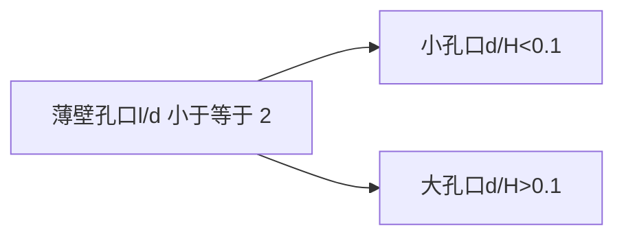

# 4.6.1孔口出流
## 孔口出流、管嘴出流及其分类
在容器壁上开口，水经孔口流出的水力现象就称为孔口出流

厚壁孔口（又称管嘴）

按照出流后的周围介质分：
自由出流，液体经孔口流入大气
淹没出流，液体经孔流入充满液体的空间

按孔口水头变化情况分：
恒定出流，孔口出流时，水箱中水量有源源不断的补充
非恒定出流，没有补充

### 管嘴出流及分类
孔口周边连接一长为$3 \sim 4$倍孔径的短管

## 薄壁孔口恒定出流
薄壁小孔口：
流速系数$C_{v}=\frac{1}{\sqrt{ 1+\zeta }}$
出流速度$v_{c}=C_{v}\sqrt{ \frac{2\Delta p}{\rho} }$
流量$q_{V}=C_{c}C_{v}\sqrt{ \frac{2\Delta p}{\rho} }A$，其中把$C_{c}C_{v}$写作$C_{q}$，称为为流量系数

四个系数，很重要，统称为出流系数
收缩系数$C_{c}=\frac{C_{q}}{C_{v}}$
阻力系数$\zeta=\frac{1}{C_{v^{2}}-1}$
流量系数$C_{q}=C_{c}C_{v}$
流速系数$C_{v}=\frac{1}{\sqrt{ 1+\zeta }}$

## 厚壁孔口恒定出流

## 孔口淹没出流与自由出流特点

# 4.6.2缝隙流动
## 1、平行平面缝隙

## 2、同心圆柱间环形缝隙

## 3、偏心圆柱间环形缝隙

## 4、平行圆盘缝隙
### （1）压差流动

### （2）挤压流动

## 5、倾斜平面间缝隙流动